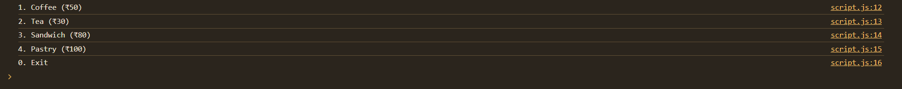
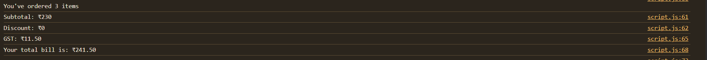
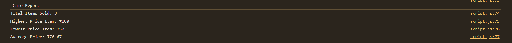
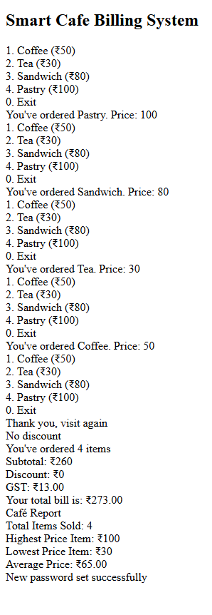

# Project-3: Smart Cafe Billing System

## Project Overview

**Smart Cafe Billing System** is a JavaScript-based project that simulates a simple billing and reporting system for a cafe. The system allows users to place orders, calculates the bill with GST and discounts, generates a cafe sales report, and provides a password change feature.

---

## Tasks Description

### 1. Place Order System

- Presents a menu with items: Coffee, Tea, Sandwich, and Pastry.
- Users can select items to order by entering the corresponding number.
- The system keeps track of the total amount, number of items, and records the highest and lowest priced items ordered.

### 2. Billing with GST and Discount

- Applies a 20% discount if the subtotal exceeds ₹1000, or 10% if it exceeds ₹500.
- Calculates GST at 5% on the discounted amount.
- Displays the subtotal, discount, GST, and the final total bill.

### 3. Café Report

- After order completion, displays a report including:
  - Total items sold
  - Highest and lowest price items
  - Average price per item
- If no sales are made, it notifies the user.

### 4. Password Change Feature

- Prompts the user to enter the current password.
- Allows the user to set and confirm a new password.
- Validates the password change process and provides appropriate feedback.

---

## Output Screenshots

### 1. Menu and Order Placement

### 2. Billing Output

### 3. Café Report

### 4. Password Change

### 5. Webpage Output

---

## How to Run

1. Open `index.html` in your browser.
2. Follow the prompts to place orders and interact with the system.
