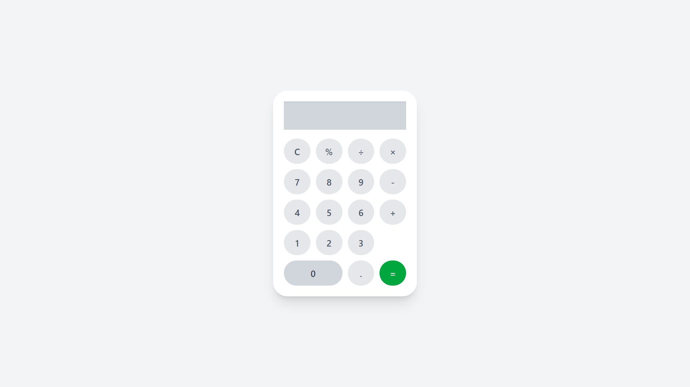

# Calculator (Samsung Style)

This project is a simple browser-based calculator designed to visually and functionally resemble the Samsung mobile calculator app. Built with HTML, Tailwind CSS, and JavaScript, it supports all fundamental arithmetic operations, a modern layout, and interactive button feedback.

## Features
- Responsive design with a mobile-friendly interface
- Large, easy-to-tap buttons arranged in a standard calculator layout
- Clean, modern appearance inspired by Samsung's calculator app
- Supports: addition, subtraction, multiplication, division, percentages, clear, decimal point, and equals
- Fully functional display area for input and results

## Getting Started
1. Open `index.html` in your browser.
2. Use mouse clicks or taps to operate the calculator.

---

## Screenshots of Calculator Operations

### Calculator Preview

#### 1. Addition

#### 2. Subtraction

#### 3. Multiplication

#### 4. Division

#### 5. Percentage

#### 6. Decimal Calculation

---