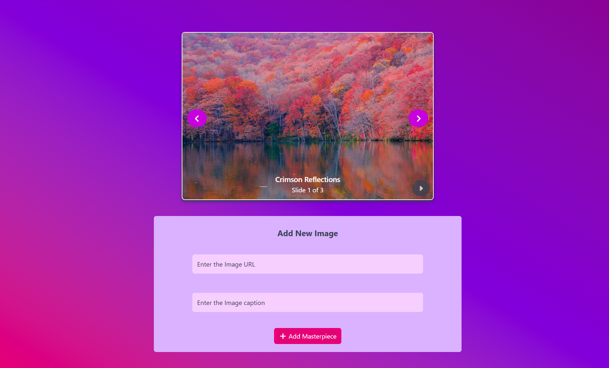
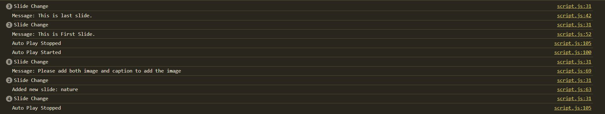

# Project-6: Image Slider Web App

## Problem Definition
Create a visually engaging and interactive image slider web application where users can:
- Browse through a predefined set of images with captions using Next/Previous controls.
- See image captions and the current slide number.
- Add new images and custom captions to the slider using input forms.
- Auto-play slides and pause the playback at any time.

The goal is to provide an easy-to-use slider interface that is user-friendly, dynamic, and visually appealing.

---

## Flow of Program

1. **Page Load**  
   - The initial image is displayed in the slider area with its caption and current position (e.g., Slide 1 of 3).

2. **Navigation**  
   - The user can click the left (`<`) or right (`>`) navigation buttons to switch between images.
   - Captions and slide counter update automatically.

3. **Auto-Play**
   - Clicking the "AutoPlay" button starts automatic slideshow mode, cycling through images at set intervals.
   - The user can stop auto-play at any time with the "Stop AutoPlay" button.

4. **Adding Images**
   - The user can enter an image URL and a caption in the input fields at the bottom section.
   - Clicking "Add Masterpeice" adds the new image to the slider and updates the slide counter.
   - Error messages are shown if required fields are empty or invalid.

5. **Live Updates**
   - All UI sections update instantly as the user interacts with the page.

---

## Output Screenshots

