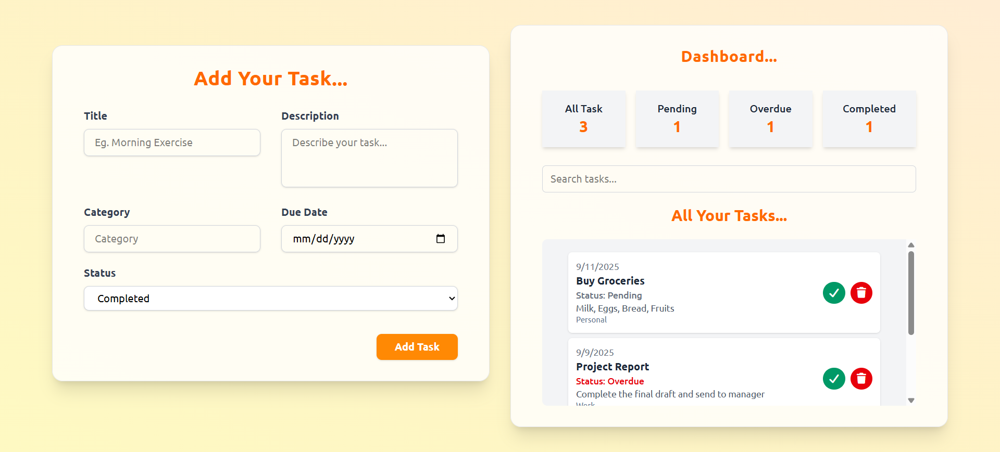

# Smart Task & Habit Tracker

A lightweight, browser-based task manager to add, track, and manage tasks with real-time dashboard stats, search, and tab-based filtering. Built with plain JavaScript and Tailwind CSS (CDN).

## Problem Definition
Managing daily tasks efficiently requires a simple interface to:
- Add tasks with title, description, category, due date, and status
- Track task status: Pending, Completed, or Overdue
- View live counts of All, Pending, Overdue, Completed tasks on a dashboard
- Filter tasks by status via tabs and quickly search by title/description/category
- Perform quick actions like completing or deleting tasks

This project solves the above using an in-memory task store (array) with a clear UI for fast task operations. It is ideal for demos or local usage without a backend.

## Step-wise Explanation

### 1) How to Run
- Open Project-7/index.html directly in a browser, or use a local server (e.g., VSCode Live Server).

### 2) How to Use
1. Fill in Title, Description, Category, Due Date, and Status, then click "Add Task".
2. Use Dashboard tabs to filter: All, Pending, Overdue, Completed.
3. Use the search box to find tasks by title, description, or category.
4. Click the check icon to mark a task as Completed.
5. Click the trash icon to delete a task.

### 3) Implementation Details
- Data Model
  - Task class encapsulates a task with fields: id, title, description, category, dueDate, status, createdAt.
  - Unique IDs are generated by a static counter.
- Status Logic
  - getStatus():
    - Returns "Completed" if the task is completed.
    - Returns "Overdue" if dueDate is before today and not completed.
    - Else returns "Pending".
  - Overdue check compares date-only (ignoring time) to avoid same-day false positives.
- Rendering Flow
  - renderTasks():
    - Applies active tab filter and search text to the tasks array.
    - Builds the task list DOM with color-coded status labels.
    - Calls updateDashboard() to refresh counts.
  - updateDashboard(): computes counts for All, Pending, Overdue, Completed using getStatus().
- Actions
  - addTask(): Validates inputs, constructs a Task, pushes to tasks[], re-renders.
  - completeTask(id): Sets status to Completed and re-renders.
  - deleteTask(id): Removes task by id and re-renders.
- UI/Styling
  - Tailwind classes are used for layout and styling via CDN (see tailwind.js include in index.html).
  - A small overlay-based alert provides user feedback.

### 4) Limitations
- Data is in-memory only and clears on page refresh. To persist, integrate LocalStorage or a backend.

Preview embeds:




## Project Structure
```
Project-7/
├─ index.html
├─ script.js
├─ tailwind.js
└─ README.md
```

## Tech Stack
- HTML, CSS (Tailwind via CDN), JavaScript
- No build step, no external runtime dependencies

## Notes
- Overdue status is computed against the current date at render time.
- Tabs visually highlight the active filter and re-render the task list.
- Search matches title, description, and category fields in a case-insensitive manner.
