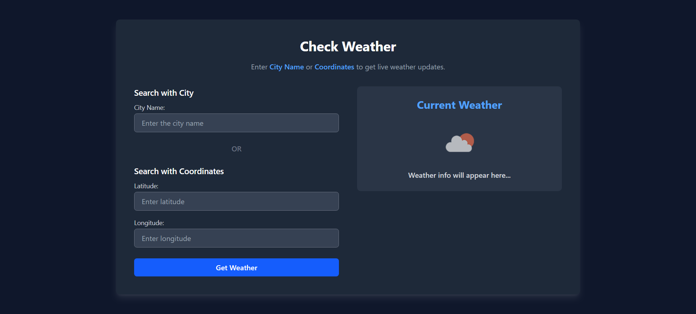
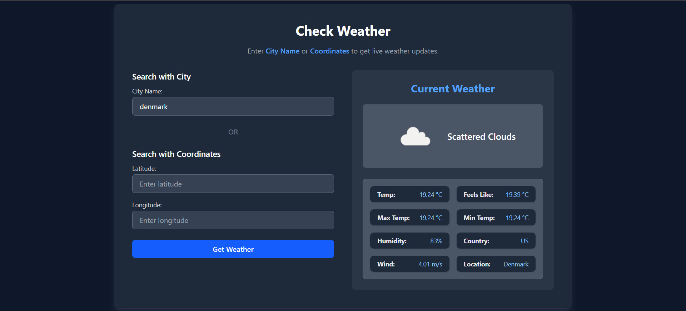

# Weather App

A modern, responsive weather application that allows users to check current weather conditions by entering either a city name or geographic coordinates (latitude and longitude).

## Problem Definition

Many users need quick access to weather information but don't always remember exact city names or want to check weather at specific coordinates. This application solves this problem by providing:

- **Dual Input Methods**: Search by city name OR geographic coordinates
- **Real-time Data**: Fetches live weather data from OpenWeatherMap API
- **Responsive Design**: Works seamlessly across desktop, tablet, and mobile devices
- **User-friendly Interface**: Clean, modern UI with clear visual feedback

## Features

- 🌍 Search weather by city name
- 📍 Search weather by latitude and longitude coordinates
- 🌡️ Displays temperature, feels-like temperature, min/max temps
- 💨 Shows wind speed and humidity levels
- 🎨 Beautiful dark-themed UI built with Tailwind CSS
- 📱 Fully responsive design
- ⚡ Real-time weather updates
- 🔄 Loading indicators for better UX

## Step-wise Explanation

### 1. **HTML Structure** (`index.html`)
   - **Header Section**: Contains the app title and description
   - **Input Section**: 
     - City name input field
     - OR separator
     - Latitude and longitude input fields for coordinate-based search
     - "Get Weather" button to trigger the API call
   - **Weather Display Section**:
     - Default placeholder with weather icon
     - Loading spinner (shown during API calls)
     - Weather information card (displays results)

### 2. **Styling**
   - Uses **Tailwind CSS** for responsive, utility-first styling
   - Custom CSS to remove number input spinners
   - Dark theme with slate-900 background and gray-800 cards
   - Hover effects and smooth transitions for better UX

### 3. **JavaScript Functionality** (`script.js`)

   **a. Event Listener Setup**
   - Listens for click on "Get Weather" button
   - Validates user input (ensures only city OR coordinates, not both)
   - Routes to appropriate fetch function

   **b. Input Validation**
   ```javascript
   - Checks if both city and coordinates are provided → Shows error
   - Checks if only city is provided → Calls fetchWeatherByCity()
   - Checks if both lat & lon are provided → Calls fetchWeatherByCoords()
   - If nothing is provided → Shows alert
   ```

   **c. API Integration**
   - **fetchWeatherByCity(city)**: Makes API call using city name
   - **fetchWeatherByCoords(lat, lon)**: Makes API call using coordinates
   - Both functions use OpenWeatherMap API with metric units (Celsius)

   **d. UI State Management**
   - **showLoading()**: Hides other elements and shows loading spinner
   - **showWeather(data)**: Displays weather information after successful fetch
   - **showError()**: Handles errors and shows alert message

   **e. Weather Data Display**
   - Extracts weather icon and description
   - Dynamically generates HTML with weather details:
     - Current temperature
     - Feels-like temperature
     - Max/Min temperatures
     - Humidity percentage
     - Country code
     - Wind speed
     - Location name

### 4. **Error Handling**
   - Try-catch blocks for API calls
   - Network error handling
   - Invalid input validation
   - User-friendly error messages via alerts

## Technologies Used

- **HTML5**: Structure and semantic markup
- **Tailwind CSS**: Utility-first CSS framework for styling
- **JavaScript (ES6+)**: Async/await, fetch API, DOM manipulation
- **OpenWeatherMap API**: Real-time weather data provider

## Screenshots

### Dashboard View
*The main interface with input fields for city name or coordinates*



**Features visible:**
- Clean, dark-themed interface
- Two input methods clearly separated
- Placeholder showing where weather data will appear

---

### Weather Results Display
*Weather information displayed after successful search*



**Information shown:**
- Weather icon and description
- Current temperature and feels-like temp
- Min/Max temperatures
- Humidity and wind speed
- Country and location name

## Setup Instructions

1. **Clone or download** the project files
2. Ensure all three files are in the same directory:
   - `index.html`
   - `script.js`
   - `tailwind.js` (Tailwind CSS standalone script)
3. Open `index.html` in a modern web browser
4. Start searching for weather by city or coordinates!

## Usage

### Search by City Name:
1. Enter a city name (e.g., "London", "New York", "Tokyo")
2. Click "Get Weather"
3. View the weather results

### Search by Coordinates:
1. Enter latitude (e.g., 51.5074)
2. Enter longitude (e.g., -0.1278)
3. Click "Get Weather"
4. View the weather results

## API Information

This app uses the **OpenWeatherMap API**. The current API key is included for demonstration purposes. For production use, you should:
- Sign up at [OpenWeatherMap](https://openweathermap.org/api)
- Generate your own API key
- Replace the `apiKey` variable in `script.js`


## License

This project is open source and available for educational purposes.
